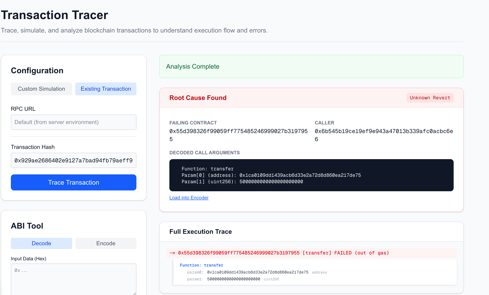

# Transaction Tracer (tx-tracer)

Transaction Tracer is a full-stack tool designed to help developers debug and analyze Ethereum transactions. It provides a visual interface to simulate transactions, view execution traces, and identify the root causes of transaction failures.

## Project Structure

This repository consists of three main components:

- **[tracer-backend](./tracer-backend)**: A Go-based service that interacts with Ethereum RPC nodes to perform `debug_traceCall` and analyze the execution stack.
- **[tracer-frontend](./tracer-frontend)**: A Next.js web interface that allows users to input transaction details, view trace results, and use ABI encoding/decoding tools.
- **[tracer-extension](./tracer-extension)**: A Chrome extension that injects a "Trace" button into Etherscan and BscScan transaction pages.

## Prerequisites

- **Go**: Version 1.20 or higher (for backend).
- **Node.js**: Version 18 or higher (for frontend).
- **Ethereum RPC Node**: An RPC endpoint that supports `debug_traceCall` or `debug_traceTransaction` (e.g., Geth, Erigon, or supported providers like Zan, Alchemy, etc.).

## Quick Start

### Option 1: One-Click Start (Recommended)

You can start both the backend and frontend services with a single script:

```bash
./start.sh
```

This will:

1. Start the backend service on port `8080`.
2. Install frontend dependencies (if missing) and start the dev server on port `3000`.

Open [http://localhost:3000](http://localhost:3000) in your browser.

### Option 2: Manual Start

If you prefer to run services manually:

#### 1. Start the Backend

The backend runs on port `8080` by default. It now requires Basic Auth configuration.

```bash
cd tracer-backend
# Set your BSC RPC URL (optional, can also be set in frontend or passed in request)
export BSC_RPC_URL="https://your-bsc-rpc-node-url"
# Set Basic Auth credentials
export BASIC_AUTH_USER="admin"
export BASIC_AUTH_PASS="your_secure_password"

go run main.go
```

For more details, see [tracer-backend/README.md](./tracer-backend/README.md).

#### 2. Start the Frontend

The frontend runs on port `3000` by default. Ensure `.env.local` is configured with RPC URLs and Basic Auth credentials.

```bash
cd tracer-frontend
# Install dependencies
npm install
# Start development server
npm run dev
```

Open [http://localhost:3000](http://localhost:3000) in your browser.

For more details, see [tracer-frontend/README.md](./tracer-frontend/README.md).

## Features

- **Transaction Simulation**: Simulate arbitrary transactions with custom `from`, `to`, `data`, and `value` fields.
- **Historical Debugging**: Replay and debug past transactions using their transaction hash.
- **Trace Visualization**: Visualize the call stack and see exactly where and why a transaction reverted.
- **Solana Support**: Basic support for Solana transaction tracing (currently supports analyzing existing transactions by hash).
- **Error Analysis**: Automatically extracts revert reasons and decoded error data.
- **ABI Tools**: Built-in utilities to encode and decode ABI parameters.
- **Browser Extension**: Helper extension to quickly trace transactions directly from blockchain explorers.

## Browser Extension

The project includes a Chrome extension to make debugging easier.

### Installation

1. Open Chrome and go to `chrome://extensions/`.
2. Enable "Developer mode" in the top right corner.
3. Click "Load unpacked".
4. Select the `tracer-extension` directory from this repository.

### Usage

1. Visit any transaction page on [Etherscan](https://etherscan.io) or [BscScan](https://bscscan.com).
2. You will see a "Trace with Tx-Tracer" button next to the transaction hash or status.
3. Click the button to open the local tracer with the transaction details pre-filled.

## Interface Preview

The frontend interface is designed for simplicity and efficiency:



### Key Components:

- **Configuration Panel**: Set your RPC URL and transaction parameters (From, To, Value, Data).
- **Trace View**: Visual representation of the transaction execution flow.
- **ABI Tool**: Helper utility for encoding and decoding contract data.
